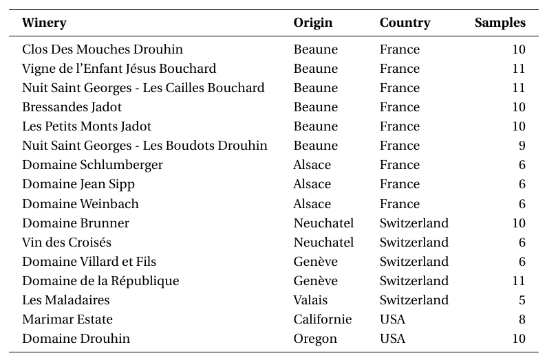

Pinot Noir Classification
=========================

In this section, we focus on the classification of Pinot Noir wine samples using the script train_test_pinot_noir.py.
The goal is to predict the winery, origin, country, or continent of each sample based on its GC-MS chemical
profile. This script implements a full pipeline including dataset loading, preprocessing, feature extraction,
and supervised classification using a configurable machine learning model.

A total of 16 wineries are considered, as shown in the following table:

The goal is to evaluate the model's accuracy in correctly predicting the winery from which each wine sample originates.

Configuration Parameters
------------------------

The script reads analysis parameters from a configuration file (`config.yaml`) located at the root of the repository.
Below is a description of the key parameters:

- **dataset**: Each dataset must be specified with a name and its corresponding path on your local machine. The paths should point to directories containing `.D` folders for each sample.

- **selected_datasets**: Selects the datasets to be used. You can join more than one but must be compatible in terms of m/z channels

- **feature_type**: Determines how the chromatogram channels are aggregated for classification.

  - ``tic``: Use the Total Ion Chromatogram only.
  - ``tis``: Use individual Total Ion Spectrum channels.
  - ``tic_tis``: Combines TIC and TIS features by concatenation.

- **classifier**: Specifies the classification model used for training. Available options include:

  - ``DTC``: Decision Tree Classifier
  - ``GNB``: Gaussian Naive Bayes
  - ``KNN``: K-Nearest Neighbors
  - ``LDA``: Linear Discriminant Analysis
  - ``LR``: Logistic Regression
  - ``PAC``: Passive-Aggressive Classifier
  - ``PER``: Perceptron
  - ``RFC``: Random Forest Classifier
  - ``RGC``: Ridge Classifier
  - ``SGD``: Stochastic Gradient Descent
  - ``SVM``: Support Vector Machine

- **num_splits**: Number of random train/test splits to evaluate model stability. Higher values improve statistical confidence.

- **normalize**: Whether to apply feature scaling (standard normalization) before classification. It is learned on training splits and applied to test split, so no leakage

- **n_decimation**: Factor by which chromatograms are downsampled along the retention time axis to reduce dimensionality.

- **sync_state**: Enables or disables retention time synchronization between samples using peak alignment algorithms.

- **region**: Indicates the classification granularity, such as:

  - ``winery``: Group samples by producer.
  - ``origin``: Group samples by geographical origin or region of production.
  - ``country``: Group samples by country.
  - ``continent``: Group samples by continent.

- **wine_kind**: This parameter is used internally to distinguish the type of wine (e.g., ``pinot_noir``, ``press``, ``champagne``) and to apply appropriate label parsing and evaluation logic.
  **This field is now automatically inferred from the dataset path and should not be set manually.**

These parameters allow users to flexibly configure the pipeline without modifying the script itself.

Script Overview
---------------

The script performs classification of Pinot Noir wine samples using GC-MS data and a configurable machine learning pipeline.
It loads all key parameters and dataset paths from a separate configuration file. To modify the experiment and the
location of your dataset, simply edit ``config.yaml`` according to your needs.

The main steps include:

1. **Configuration loading**:

   - Loads experiment settings from ``config.yaml``.
   - This includes paths to the datasets, the number of evaluation splits, the classifier type, and other parameters.

2. **Data Loading and Preprocessing**:

   - GC-MS chromatograms are loaded using `GCMSDataProcessor`.
   - Datasets are joined and decimated according to the defined factor.
   - Channels with zero variance are removed.
   - Optionally, retention time alignment (synchronization) is performed if `sync_state` is enabled in the config.
   - Optionally, data normalization (recommended), using training-set statistics only to avoid leakage.

3. **Label Processing**:

   - Sample labels are extracted and grouped according to the selected `region` (e.g., winery, origin, country or continent).
   - These labels are prepared for supervised classification.

4. **Classification**:

   - The `Classifier` class is used to train a machine learning model on the processed data.
   - The `train_and_evaluate_all_channels()` method evaluates model performance across multiple splits.
   - Classification features are aggregated as specified by the `feature_type` parameter (e.g., TIC, TIS, or both).

5. **Evaluation**:

   - Accuracy results are printed.
   - Optionally, confusion matrices can be converted to LaTeX using provided helper functions for reporting.

This script provides a complete, reproducible workflow to test classification accuracy of Pinot Noir wines using chemical
profiles extracted from GC-MS data.

Requirements
------------

- Properly structured GC-MS data directories
- Required dependencies installed (see `README.md`)
- Adjust paths in `DATASET_DIRECTORIES` to match your local setup

Usage
-----

From the root of the repository, run:

.. code-block:: bash

   python scripts/pinot_noir/train_test_pinot_noir.py
